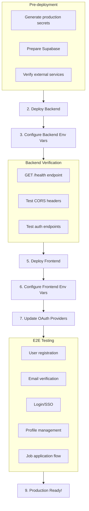

# NCPnext Initial Deployment Plan

**Deployment Strategy:** Vercel (Frontend + Backend as Serverless Functions)  
**Date:** February 2026  
**Status:** Planning Phase

---

## 1. Architecture Overview

### Current Setup
```
┌──────────────────┐         ┌─────────────────────────────────────┐
│   Next.js        │         │       Express API Server            │
│   Frontend       │  HTTP   │       http://localhost:4000          │
│   :3000          │────────►│                                     │
│                  │  JWT    │  Middleware → Routes → Controller   │
│                  │◄────────│  → Service → Repository             │
└──────────────────┘         └──────────────┬──────────────────────┘
                                             │
                              ┌──────────────▼──────────────────────┐
                              │  Supabase PostgreSQL + Storage      │
                              │  12 tables, RLS enabled             │
                              └─────────────────────────────────────┘
```

### Target Deployment Architecture
```
┌─────────────────────────────────────────────────────────────────────────────┐
│                              VERCEL                                          │
│  ┌─────────────────────────────┐    ┌─────────────────────────────────────┐ │
│  │   Frontend Project          │    │   Backend Project                    │ │
│  │   ncp-next.vercel.app       │    │   ncp-backend.vercel.app             │ │
│  │                             │    │                                      │ │
│  │   Next.js 16 SSR/SSG        │    │   Express.js → Serverless Functions  │
│  │   - App Router              │    │   - /api/* → api/index.ts            │ │
│  │   - React 19                │    │   - 10s timeout (Hobby)              │ │
│  │   - Static Assets           │    │   - 60s timeout (Pro)                │ │
│  └──────────────┬──────────────┘    └──────────────┬──────────────────────┘ │
└─────────────────┼───────────────────────────────────┼───────────────────────┘
                  │                                   │
                  │         HTTP/HTTPS                │
                  └───────────────────────────────────┘
                              │
                              ▼
              ┌───────────────────────────────┐
              │   Supabase Cloud              │
              │   - PostgreSQL Database       │
              │   - Storage Buckets           │
              │   - Authentication (optional) │
              └───────────────────────────────┘
```

---

## 2. Deployment Projects

### 2.1 Frontend Deployment (Next.js)

| Setting | Value |
|---------|-------|
| **Project Name** | `ncp-next` |
| **Framework** | Next.js 16.1.6 |
| **Build Command** | `npm run build` |
| **Output Directory** | `.next` |
| **Install Command** | `npm install` |
| **Node.js Version** | 22.x |

### 2.2 Backend Deployment (Express.js → Serverless)

| Setting | Value |
|---------|-------|
| **Project Name** | `ncp-backend` |
| **Framework** | Other (Serverless Functions) |
| **Build Command** | `npm run build` |
| **Output Directory** | `dist` |
| **Install Command** | `npm install` |
| **Node.js Version** | 22.x |

---

## 3. Backend Serverless Adaptation

### 3.1 Required Changes

The Express.js backend needs to be adapted for Vercel serverless functions. This involves:

#### A. Create Vercel Entry Point

Create [`api/index.ts`](backend/api/index.ts) that exports the Express app as a serverless function:

```typescript
// backend/api/index.ts
import app from '../src/app';

export default app;
```

#### B. Create vercel.json Configuration

Create [`backend/vercel.json`](backend/vercel.json):

```json
{
  "version": 2,
  "builds": [
    {
      "src": "api/index.ts",
      "use": "@vercel/node"
    }
  ],
  "routes": [
    {
      "src": "/(.*)",
      "dest": "/api/index.ts"
    }
  ]
}
```

#### C. Update app.ts for Serverless

Modify [`backend/src/app.ts`](backend/src/app.ts) to:
- Export the Express app (not start the server)
- Handle serverless-specific concerns

#### D. File Upload Handling

Current implementation uses Multer with Supabase Storage - this is compatible with serverless since files are stored externally, not on local filesystem.

### 3.2 Serverless Considerations

| Concern | Impact | Mitigation |
|---------|--------|------------|
| **Cold Starts** | Initial request latency | Acceptable for this use case |
| **10s Timeout** (Hobby) | Long operations may timeout | Resume parsing uses AI - may need Pro plan |
| **No Persistent Filesystem** | Cannot store files locally | Already using Supabase Storage ✓ |
| **Stateless** | No in-memory sessions | Using JWT tokens ✓ |
| **Environment Variables** | Must be set in Vercel dashboard | Document all required vars |

---

## 4. Environment Variables

### 4.1 Backend Environment Variables

Set in Vercel Dashboard → ncp-backend → Settings → Environment Variables:

| Variable | Required | Source |
|----------|----------|--------|
| `NEXT_PUBLIC_SUPABASE_URL` | ✅ | From Supabase dashboard |
| `SUPABASE_SERVICE_ROLE_KEY` | ✅ | From Supabase dashboard |
| `NEXTAUTH_SECRET` | ✅ | Generate new for production |
| `CORS_ORIGIN` | ✅ | Your frontend URL (e.g., `https://ncp-next.vercel.app`) |
| `FRONTEND_URL` | ✅ | Your frontend URL |
| `RESEND_API_KEY` | ✅ | From Resend dashboard |
| `RESEND_FROM_EMAIL` | ✅ | Your verified sender email |
| `GOOGLE_AI_API_KEY` | ⚪ | From Google AI Studio |
| `OPENAI_API_KEY` | ⚪ | From OpenAI dashboard |
| `NOVU_API_KEY` | ⚪ | From Novu dashboard |
| `GOOGLE_CLIENT_ID` | ⚪ | From Google Cloud Console |
| `GOOGLE_CLIENT_SECRET` | ⚪ | From Google Cloud Console |
| `LINKEDIN_CLIENT_ID` | ⚪ | From LinkedIn Developers |
| `LINKEDIN_CLIENT_SECRET` | ⚪ | From LinkedIn Developers |
| `FACEBOOK_CLIENT_ID` | ⚪ | From Facebook Developers |
| `FACEBOOK_CLIENT_SECRET` | ⚪ | From Facebook Developers |
| `JWT_ACCESS_EXPIRY` | ⚪ | Default: `24h` |
| `JWT_REFRESH_EXPIRY` | ⚪ | Default: `7d` |

### 4.2 Frontend Environment Variables

Set in Vercel Dashboard → ncp-next → Settings → Environment Variables:

| Variable | Required | Value |
|----------|----------|-------|
| `NEXT_PUBLIC_API_URL` | ✅ | `https://ncp-backend.vercel.app/api/v1` |
| `NEXT_PUBLIC_SUPABASE_URL` | ✅ | From Supabase dashboard |
| `NEXT_PUBLIC_SUPABASE_ANON_KEY` | ✅ | From Supabase dashboard |
| `NEXTAUTH_SECRET` | ✅ | Same as backend |
| `NEXTAUTH_URL` | ✅ | `https://ncp-next.vercel.app` |
| `NEXT_PUBLIC_NOVU_APPLICATION_IDENTIFIER` | ⚪ | From Novu dashboard |

---

## 5. OAuth Provider Configuration

After deployment, update OAuth redirect URIs:

### Google Cloud Console
- **Authorized JavaScript origins:** 
  - `https://ncp-next.vercel.app`
  - `https://ncp-backend.vercel.app`
- **Authorized redirect URIs:**
  - `https://ncp-backend.vercel.app/api/v1/auth/sso/google/callback`

### LinkedIn Developers
- **Redirect URLs:**
  - `https://ncp-backend.vercel.app/api/v1/auth/sso/linkedin/callback`

### Facebook Developers
- **Valid OAuth Redirect URIs:**
  - `https://ncp-backend.vercel.app/api/v1/auth/sso/facebook/callback`

---

## 6. Deployment Sequence



### Step-by-Step Deployment

#### Phase 1: Backend Deployment

1. **Create Backend Project on Vercel**
   - Go to vercel.com → New Project
   - Import GitHub repository
   - Set **Root Directory** to `backend`
   - Framework: Other

2. **Configure Backend Build Settings**
   - Build Command: `npm run build`
   - Output Directory: `dist`
   - Install Command: `npm install`

3. **Add Backend Environment Variables**
   - Add all required variables from Section 4.1
   - **Important:** Generate a new `NEXTAUTH_SECRET` for production

4. **Deploy Backend**
   - Click Deploy
   - Note the deployment URL (e.g., `https://ncp-backend.vercel.app`)

5. **Verify Backend**
   ```bash
   # Health check
   curl https://ncp-backend.vercel.app/health
   
   # CORS check
   curl -H "Origin: https://ncp-next.vercel.app" \
        -H "Access-Control-Request-Method: GET" \
        -X OPTIONS \
        https://ncp-backend.vercel.app/api/v1/health
   ```

#### Phase 2: Frontend Deployment

1. **Create Frontend Project on Vercel**
   - Go to vercel.com → New Project
   - Import GitHub repository
   - Set **Root Directory** to `frontend`
   - Framework: Next.js (auto-detected)

2. **Configure Frontend Environment Variables**
   - Add all required variables from Section 4.2
   - Set `NEXT_PUBLIC_API_URL` to backend URL

3. **Deploy Frontend**
   - Click Deploy
   - Note the deployment URL (e.g., `https://ncp-next.vercel.app`)

#### Phase 3: Post-Deployment Configuration

1. **Update OAuth Provider Redirect URIs**
   - Update Google, LinkedIn, Facebook with production URLs

2. **Update CORS Settings**
   - Ensure backend `CORS_ORIGIN` matches frontend URL

3. **Test Complete User Flows**
   - Registration with email verification
   - Login (email/password and SSO)
   - Profile management
   - Job browsing and application

---

## 7. Code Changes Required

### 7.1 Backend Changes

| File | Change | Priority |
|------|--------|----------|
| [`api/index.ts`](backend/api/index.ts) | Create new - serverless entry point | High |
| [`vercel.json`](backend/vercel.json) | Create new - Vercel configuration | High |
| [`src/app.ts`](backend/src/app.ts) | Export app for serverless | High |
| [`src/server.ts`](backend/src/server.ts) | Keep for local development | Medium |

### 7.2 Frontend Changes

| File | Change | Priority |
|------|--------|----------|
| [`next.config.ts`](frontend/next.config.ts) | Update for production API URL | High |
| [`.env.production`](frontend/.env.production) | Create production environment file | Medium |

---

## 8. Verification Checklist

### Backend Health Checks

- [ ] `GET /health` returns 200
- [ ] CORS headers present for frontend origin
- [ ] Rate limiting working
- [ ] JWT tokens generated correctly
- [ ] Database connection successful

### Frontend Health Checks

- [ ] Landing page loads
- [ ] Login page renders
- [ ] API calls reach backend
- [ ] Static assets served correctly
- [ ] No console errors

### Integration Tests

- [ ] User registration flow
- [ ] Email verification
- [ ] Password reset
- [ ] Login (email/password)
- [ ] SSO login (Google/LinkedIn/Facebook)
- [ ] Profile creation/editing
- [ ] Resume upload and parsing
- [ ] Job browsing
- [ ] Job application submission
- [ ] Admin dashboard access

---

## 9. Rollback Plan

If deployment fails or issues are found:

1. **Immediate Rollback**
   - Vercel Dashboard → Deployments → Select previous deployment → Promote to Production

2. **Database Rollback**
   - Supabase dashboard → Database → Backups → Restore

3. **Environment Variable Issues**
   - Update in Vercel dashboard
   - Trigger new deployment

---

## 10. Cost Estimation

### Vercel Hobby Plan (Free)

| Resource | Limit | Expected Usage |
|----------|-------|----------------|
| Bandwidth | 100 GB/month | Sufficient for initial launch |
| Serverless Functions | 12,000 GB-hours | Sufficient |
| Build Minutes | 6,000 minutes/month | Sufficient |
| Timeout | 10 seconds | May need Pro for AI operations |

### Potential Upgrade Triggers

- AI resume parsing exceeds 10s timeout → Upgrade to Pro ($20/month)
- Bandwidth exceeds 100GB → Monitor and upgrade as needed
- Need team collaboration → Team plan ($30/user/month)

---

## 11. Security Considerations

### Production Security Checklist

- [ ] Generate new `NEXTAUTH_SECRET` (do not reuse development secret)
- [ ] Verify Supabase RLS policies are enabled
- [ ] Ensure no sensitive data in client-side code
- [ ] Verify CORS is restricted to frontend domain only
- [ ] Check rate limiting is configured appropriately
- [ ] Verify HTTPS is enforced (automatic on Vercel)
- [ ] Review OAuth app permissions and scopes

### Secrets Management

- Never commit `.env` files to Git
- Use Vercel's encrypted environment variables
- Rotate secrets periodically
- Use different secrets for different environments

---

## 12. Next Steps

1. **Review this plan** and confirm deployment approach
2. **Switch to Code mode** to implement required code changes
3. **Deploy backend** first with environment variables
4. **Deploy frontend** with updated API URL
5. **Configure OAuth providers** with production URLs
6. **Run verification tests**
7. **Monitor and iterate**

---

## Appendix A: Quick Reference Commands

```bash
# Local development
cd backend && npm run dev     # Start backend on :4000
cd frontend && npm run dev    # Start frontend on :3000

# Build commands
cd backend && npm run build   # Compile TypeScript
cd frontend && npm run build  # Build Next.js

# Production start (for non-Vercel hosting)
cd backend && npm start       # Start compiled backend
cd frontend && npm start      # Start Next.js server
```

## Appendix B: Useful Vercel CLI Commands

```bash
# Install Vercel CLI
npm i -g vercel

# Deploy from CLI
vercel --prod

# View logs
vercel logs [deployment-url]

# List deployments
vercel list

# Pull environment variables
vercel env pull
```

---

**Document Version:** 1.0  
**Last Updated:** February 2026
